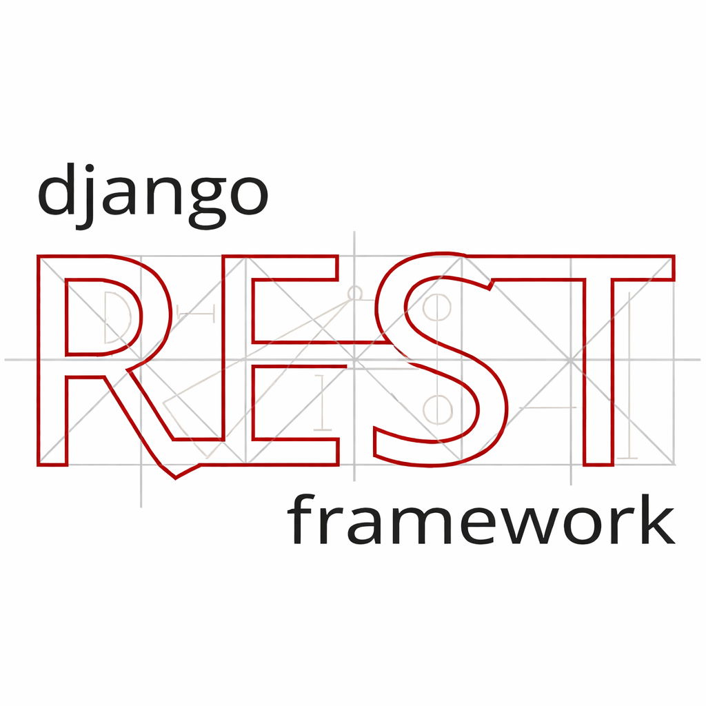

# Hi, I’m Ibrahim 👋
**Python Backend Developer** • **Agentic AI Engineer**  
📍 Doha, Qatar • ✅ Open to **Backend** & **Agentic AI Engineer** roles

  
  

---

## About
I build production-grade APIs and reliable agentic AI workflows end-to-end: backend, retrieval, testing, and deployment.

- **APIs:** FastAPI, Django REST Framework, OpenAPI/Swagger
- **Agents:** tool/function calling, routing, retries/fallbacks, structured outputs
- **RAG:** embeddings, vector search (pgvector), source-backed responses
- **Delivery:** Docker + Nginx + Ubuntu VPS, CI/CD, logging & tracing

---

## Programming languages

  
  

---

## Backend frameworks

  
  
  

---

## Agentic AI & RAG

  
  
  

---

## Databases

  
  

---

## DevOps & delivery

  
  
  

---

## Testing & tooling

  
  
  

---

## Featured repositories
- **[fastapi-pgvector-rag](https://github.com/IbrahimHerawi/fastapi-pgvector-rag)** — Local RAG Document Q&A API (FastAPI + Postgres/pgvector + Ollama)
- **[A-Drop-of-Life](https://github.com/IbrahimHerawi/A-Drop-of-Life)** — Blood Bank Management System (Django + PostgreSQL)

---

## Let’s connect 🤝
If you're hiring or want to collaborate on backend systems or agentic AI, reach out:

- 📧 **Email:** herawiibrahim@gmail.com  
- 🔗 **LinkedIn:** https://www.linkedin.com/in/ibrahim-herawi/
